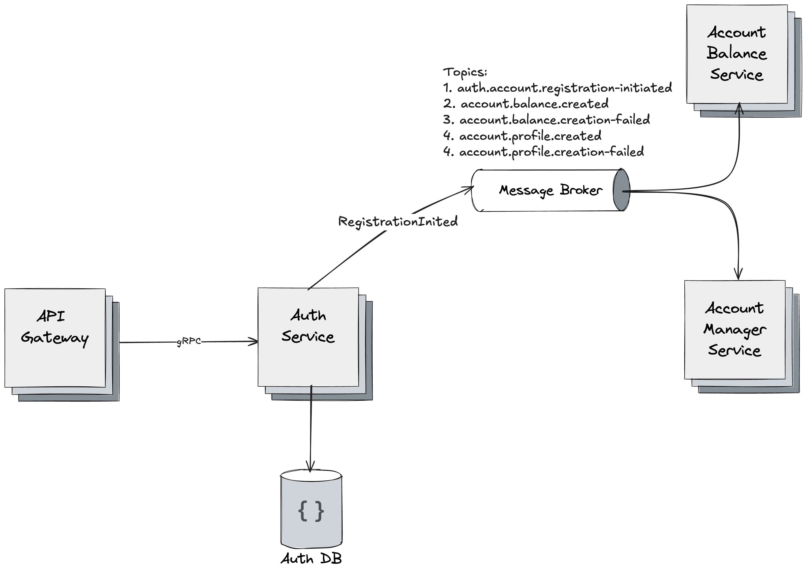

# GoPay Service

## Overview

TODO: Write

## Architecture

### 1.1 General Project Architecture

### 1.2 User Flows

#### 1.2.1 User registration flow

1. Client initialises an account registration.
2. The request is sent via HTTP v2 to API Gateway.
3. API Gateway validates and convert data to Protobuf, then gRPC request is sent to Auth Service.
4. Auth Service initialises a new account registration flow.
    1. Auth Service validates business data. (e.g. password, email)
    2. Auth Service saves user`s data to the database with "PENDING" status.
    3. Auth Service publishes "RegistrationInitiated" event to a message broker, to an "
       auth.account.registration-initiated" topic, to inform Account Manager and Account Balances about registration
       flow was triggered.
    4. Account Manager and Account Balance services reads from "auth.account.registration-initiated".
        1. If account manager fails with an error, ProfileCreationFailed event will be sent to "
           account.profile.creation-failed" topic, else ProfileCreated event will be sent to "account.profile.created"
           topic.
        2. If account balance fails with an error, BalanceCreationFailed event will be sent to "
           account.balance.creation-failed" topic, else BalanceCreated event will be sent to "account.balance.created"
           topic.
    5. Auth Service waits for both ProfileCreated and BalanceCreated events. 
       1. If both events are received, registration confirms and status "REGISTERED" is set, else "FAILED" status is set.

## Services

TODO: Describe

### Gateway Service
